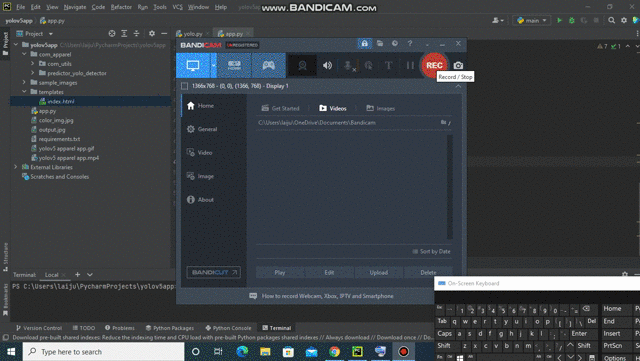

# Industrial Safety Apparel Detection using YOLOv5


This repository consists of files required for end to end implementation and deployment of Industrial Safety Apparel Detection using YOLOv5 web application deployed with flask.

## Table of Contents
  * [About the App](#about-the-app)
  * [Technologies Used](#technologies-used)
  * [Bug / Feature Request](#bug---feature-request)


## About the App

A glimpse of the web app:



The Industrial Safety Apparel Detection is a flask web application developed with Yolo v5 which detects 'Safety vest', 'hat', 'goggles', 'glove', 'shoe'.

To install the required packages and libraries, run this command in the project directory after [cloning](https://github.com/laijupjoy/Industrial-Safety-Apparel-Detection-using-YOLOv5.git) the repository:
```bash
pip install -r requirements.txt
```
To run the web app in local environment, use the command
```bash
python app.py
```

## Technologies Used

   Yolo v5

   Flask

## Bug / Feature Request

If you find a bug (the website couldn't handle the query and / or gave undesired results), kindly open an [issue](https://github.com/laijupjoy/Industrial-Safety-Apparel-Detection-using-YOLOv5.git/issues) here by including your search query and the expected result

